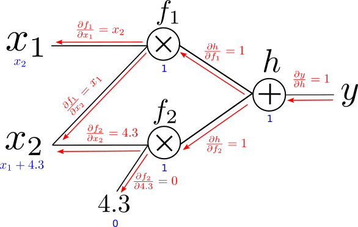

# 反向传播


首先用一个简单的例子，这个例子来自[Understanding Deep Learning](https://udlbook.github.io/udlbook/) 。通过这个例子来说明反向传播是如何工作的，考虑一个函数如下：
$$
\mbox{f}[x,\boldsymbol\phi] = \beta_3+\omega_3\cdot\cos\Bigl[\beta_2+\omega_2\cdot\exp\bigl[\beta_1+\omega_1\cdot\sin[\beta_0+\omega_0x]\bigr]\Bigr] \tag{1.1}
$$
其中参数为  $\boldsymbol\phi=\{\beta_0,\omega_0,\beta_1,\omega_1,\beta_2,\omega_2,\beta_3,\omega_3\}$ 。
假定有损失函数为
$$
\ell_i = (\mbox{f}[x_i,\boldsymbol\phi]-y_i)^2, \tag{1.2}
$$
如果我们知道所有的参数$\beta_{0},\beta_{1},\beta_{2},\beta_{3},\omega_{0},\omega_{1},\omega_{2},\omega_{3}, x_i \ \ {and} \ \ y_i.$ 我们可以很容易的计算 $\ell_i$ 。但是我们想知道当$\ell_i$ 产生微小变化的时候，这些参数的相应的变化，也就是 $\ell_i$ 相对这些参数的微分：
$$
\frac{\partial \ell_i}{\partial \beta_{0}}, \quad \frac{\partial \ell_i}{\partial \beta_{1}}, \quad \frac{\partial \ell_i}{\partial \beta_{2}}, \quad \frac{\partial \ell_i }{\partial \beta_{3}},  \quad \frac{\partial \ell_i}{\partial \omega_{0}}, \quad \frac{\partial \ell_i}{\partial \omega_{1}}, \quad \frac{\partial \ell_i}{\partial \omega_{2}},  \quad\mbox{and} \quad \frac{\partial \ell_i}{\partial \omega_{3}}.
$$


## 手动计算微分

以 $\ell_i$ 对 $\omega_0$ 的微分举例，直接手算展开可得：
$$
\begin{align*}
\frac{\partial \ell_i}{\partial \omega_{0}} &=& -2 \left( \beta_3+\omega_3\cdot\cos\Bigl[\beta_2+\omega_2\cdot\exp\bigl[\beta_1+\omega_1\cdot\sin[\beta_0+\omega_0\cdot x_i]\bigr]\Bigr]-y_i\right)\nonumber \\
&&\hspace{0.5cm}\cdot \omega_1\omega_2\omega_3\cdot x_i\cdot\cos[\beta_0+\omega_0 \cdot x_i]\cdot\exp\Bigl[\beta_1 + \omega_1 \cdot \sin[\beta_0+\omega_0\cdot x_i]\Bigr]\nonumber\\
&& \hspace{1cm}\cdot \sin\biggl[\beta_2+\omega_2\cdot \exp\Bigl[\beta_1 + \omega_1 \cdot \sin[\beta_0+\omega_0\cdot x_i]\Bigr]\biggr]
\end{align*} \tag{1.3}
$$
python代码如下：

```python
import numpy as np

def fn(x, beta0, beta1, beta2, beta3, omega0, omega1, omega2, omega3):
  return beta3+omega3 * np.cos(beta2 + omega2 * np.exp(beta1 + omega1 * np.sin(beta0 + omega0 * x)))

def loss(x, y, beta0, beta1, beta2, beta3, omega0, omega1, omega2, omega3):
  diff = fn(x, beta0, beta1, beta2, beta3, omega0, omega1, omega2, omega3) - y
  return diff * diff

beta0 = 1.0; beta1 = 2.0; beta2 = -3.0; beta3 = 0.4
omega0 = 0.1; omega1 = -0.4; omega2 = 2.0; omega3 = 3.0
x = 2.3; y =2.0
l_i_func = loss(x,y,beta0,beta1,beta2,beta3,omega0,omega1,omega2,omega3)
# print('l_i=%3.3f'%l_i_func)

dldbeta3_func = 2 * (beta3 +omega3 * np.cos(beta2 + omega2 * np.exp(beta1+omega1 * np.sin(beta0+omega0 * x)))-y)
dldomega0_func = -2 *(beta3 +omega3 * np.cos(beta2 + omega2 *                                  np.exp(beta1+omega1 * np.sin(beta0+omega0 * x)))-y) * \
              omega1 * omega2 * omega3 * x * np.cos(beta0 + omega0 * x) *                      np.exp(beta1 +omega1 * np.sin(beta0 + omega0 * x)) *\
              np.sin(beta2 + omega2 * np.exp(beta1+ omega1* np.sin(beta0+omega0                * x)))
```


用有限差分验算的python代码：

```python
dldomega0_fd = (loss(x,y,beta0,beta1,beta2,beta3,omega0+0.00001,omega1,omega2,omega3)-loss(x,y,beta0,beta1,beta2,beta3,omega0,omega1,omega2,omega3))/0.00001

print('dydomega0: Function value = %3.3f, Finite difference value = %3.3f'%(dldomega0_func,dldomega0_fd))


''' Output
dydomega0: Function value = 5.246, Finite difference value = 5.246
'''
```


## 反向传播计算微分 

用反向传播的思想重新计算以 $\ell_i$ 对 $\omega_0$ 的微分，重新引入记号：
$$
\begin{align*}
f_{0} &=& \beta_{0} + \omega_{0} x_i\nonumber\\

h_{1} &=& \sin[f_{0}]\nonumber\\

f_{1} &=& \beta_{1} + \omega_{1}h_{1}\nonumber\\

h_{2} &=& \exp[f_{1}]\nonumber\\

f_{2} &=& \beta_{2} + \omega_{2} h_{2}\nonumber\\

h_{3} &=& \cos[f_{2}]\nonumber\\

f_{3} &=& \beta_{3} + \omega_{3}h_{3}\nonumber\\

l_i &=& (f_3-y_i)^2
\end{align*} \tag{1.4}
$$

#### Step 1. Forward Pass

首先通过**前向传播**计算所有的中间变量：
```python
f0 = beta0 + omega0*x
h1 = np.sin(f0)
f1 = beta1 + omega1*h1
h2 = np.exp(f1)
f2 = beta2 + omega2*h2
h3 = np.cos(f2)
f3 = beta3 + omega3*h3
l_i = (f3 - y)**2

print("f0: true value = %3.3f, your value = %3.3f"%(1.230, f0))
print("h1: true value = %3.3f, your value = %3.3f"%(0.942, h1))
print("f1: true value = %3.3f, your value = %3.3f"%(1.623, f1))
print("h2: true value = %3.3f, your value = %3.3f"%(5.068, h2))
print("f2: true value = %3.3f, your value = %3.3f"%(7.137, f2))
print("h3: true value = %3.3f, your value = %3.3f"%(0.657, h3))
print("f3: true value = %3.3f, your value = %3.3f"%(2.372, f3))
print("like original = %3.3f, like from forward pass = %3.3f"%(l_i_func, l_i))


''' Output
f0: true value = 1.230, your value = 1.230
h1: true value = 0.942, your value = 0.942
f1: true value = 1.623, your value = 1.623
h2: true value = 5.068, your value = 5.068
f2: true value = 7.137, your value = 7.137
h3: true value = 0.657, your value = 0.657
f3: true value = 2.372, your value = 2.372
like original = 0.139, like from forward pass = 0.139
'''
```


#### Step 2. Backward pass
$$
\quad \frac{\partial \ell_i}{\partial f_3}, \quad \frac{\partial \ell_i}{\partial h_3}, \quad \frac{\partial \ell_i}{\partial f_2}, \quad

\frac{\partial \ell_i}{\partial h_2}, \quad \frac{\partial \ell_i}{\partial f_1}, \quad \frac{\partial \ell_i}{\partial h_1}, \quad\mbox{and} \quad \frac{\partial \ell_i}{\partial f_0} \tag{1.5}
$$
首先计算，
$$
\frac{\partial \ell_i}{\partial f_{3}} = 2 (f_3-y) \tag{1.6}
$$
然后计算，
$$
\frac{\partial \ell_i}{\partial h_{3}} =\frac{\partial f_{3}}{\partial h_{3}} \frac{\partial \ell_i}{\partial f_{3}}  \tag{1.7}
$$
这一步可以看到，当计算$\frac{\partial \ell_i}{\partial h_{3}}$ 时，$\frac{\partial \ell_i}{\partial f_{3}}$ 在上一步已经计算过了，并且因为第一步**前向传播** 的时候已经计算了所有的中间变量，因此$\frac{\partial \ell_i}{\partial f_{3}}$ 可以直接计算出来。如果自己写过Pytorch自定义反向传播的函数，就知道自定义函数中需要重写`backward(ctx, grad_output)` 这个方法，这里的`grad_output` 就是在上一步直接计算出来的值，这样通过反向传播计算到最后的时候计算量大大降低。
$$
\begin{align*}
\frac{\partial \ell_i}{\partial f_{2}} &=& \frac{\partial h_{3}}{\partial f_{2}}\left(

\frac{\partial f_{3}}{\partial h_{3}}\frac{\partial \ell_i}{\partial f_{3}} \right)

\nonumber \\

\frac{\partial \ell_i}{\partial h_{2}} &=& \frac{\partial f_{2}}{\partial h_{2}}\left(\frac{\partial h_{3}}{\partial f_{2}}\frac{\partial f_{3}}{\partial h_{3}}\frac{\partial \ell_i}{\partial f_{3}}\right)\nonumber \\

\frac{\partial \ell_i}{\partial f_{1}} &=& \frac{\partial h_{2}}{\partial f_{1}}\left( \frac{\partial f_{2}}{\partial h_{2}}\frac{\partial h_{3}}{\partial f_{2}}\frac{\partial f_{3}}{\partial h_{3}}\frac{\partial \ell_i}{\partial f_{3}} \right)\nonumber \\

\frac{\partial \ell_i}{\partial h_{1}} &=& \frac{\partial f_{1}}{\partial h_{1}}\left(\frac{\partial h_{2}}{\partial f_{1}} \frac{\partial f_{2}}{\partial h_{2}}\frac{\partial h_{3}}{\partial f_{2}}\frac{\partial f_{3}}{\partial h_{3}}\frac{\partial \ell_i}{\partial f_{3}} \right)\nonumber \\

\frac{\partial \ell_i}{\partial f_{0}} &=& \frac{\partial h_{1}}{\partial f_{0}}\left(\frac{\partial f_{1}}{\partial h_{1}}\frac{\partial h_{2}}{\partial f_{1}} \frac{\partial f_{2}}{\partial h_{2}}\frac{\partial h_{3}}{\partial f_{2}}\frac{\partial f_{3}}{\partial h_{3}}\frac{\partial \ell_i}{\partial f_{3}} \right)
\end{align*} \tag{1.8}
$$
上面的公式就可以看到括号内的部分都是上一步计算过的，也就是自定义函数中的`grad_output`。


Python验算代码如下：

```python
dldf3 = 2* (f3 - y)
dldh3 = omega3 * dldf3
df3dh3 = omega3
dh3df2 = -np.sin(f2)
dldf2 = dh3df2 * df3dh3 * dldf3
dldh2 = omega2 * dldf2
dldf1 = np.exp(f1) * dldh2
dldh1 = omega1 * dldf1
dldf0 = np.cos(f0) * dldh1

print("dldf3: true value = %3.3f, your value = %3.3f"%(0.745, dldf3))
print("dldh3: true value = %3.3f, your value = %3.3f"%(2.234, dldh3))
print("dldf2: true value = %3.3f, your value = %3.3f"%(-1.683, dldf2))
print("dldh2: true value = %3.3f, your value = %3.3f"%(-3.366, dldh2))
print("dldf1: true value = %3.3f, your value = %3.3f"%(-17.060, dldf1))
print("dldh1: true value = %3.3f, your value = %3.3f"%(6.824, dldh1))
print("dldf0: true value = %3.3f, your value = %3.3f"%(2.281, dldf0))


''' Output 
dldf3: true value = 0.745, your value = 0.745
dldh3: true value = 2.234, your value = 2.234
dldf2: true value = -1.683, your value = -1.683
dldh2: true value = -3.366, your value = -3.366
dldf1: true value = -17.060, your value = -17.060
dldh1: true value = 6.824, your value = 6.824
dldf0: true value = 2.281, your value = 2.281
'''
```


最后，计算对 $\omega$ 和 $\beta$ 的微分：
$$
\begin{align*}
\frac{\partial \ell_i}{\partial \beta_{k}} &=& \frac{\partial f_{k}}{\partial \beta_{k}}\frac{\partial \ell_i}{\partial f_{k}}\nonumber \\

\frac{\partial \ell_i}{\partial \omega_{k}} &=& \frac{\partial f_{k}}{\partial \omega_{k}}\frac{\partial \ell_i}{\partial f_{k}}.
\end{align*} \tag{1.9}
$$

最后一步的公式为 $f_{k}=\beta_{k}+\omega_k \cdot h_{k}$ ，可得：
$$
\frac{\partial f_{k}}{\partial \beta_{k}} = 1 \ \ \ \ {and} \ \ \ \ \frac{\partial f_{k}}{\partial \omega_{k}} = h_{k} \tag{1.10}
$$

```python

dldbeta3 = 2* (f3 - y)
dldomega3 = 2* (f3 - y) * h3
dldbeta2 = dldf2 
dldomega2 = dldf2 * h2
dldbeta1 = dldf1 
dldomega1 = dldf1 * h1
dldbeta0 = dldf0
dldomega0 = dldf0 * x

print('dldbeta3: Your value = %3.3f, True value = %3.3f'%(dldbeta3, 0.745))
print('dldomega3: Your value = %3.3f, True value = %3.3f'%(dldomega3, 0.489))
print('dldbeta2: Your value = %3.3f, True value = %3.3f'%(dldbeta2, -1.683))
print('dldomega2: Your value = %3.3f, True value = %3.3f'%(dldomega2, -8.530))
print('dldbeta1: Your value = %3.3f, True value = %3.3f'%(dldbeta1, -17.060))
print('dldomega1: Your value = %3.3f, True value = %3.3f'%(dldomega1, -16.079))
print('dldbeta0: Your value = %3.3f, True value = %3.3f'%(dldbeta0, 2.281))
print('dldomega0: Your value = %3.3f, Function value = %3.3f, Finite difference value = %3.3f'%(dldomega0, dldomega0_func, dldomega0_fd))


''' Output
dldbeta3: Your value = 0.745, True value = 0.745
dldomega3: Your value = 0.489, True value = 0.489
dldbeta2: Your value = -1.683, True value = -1.683
dldomega2: Your value = -8.530, True value = -8.530
dldbeta1: Your value = -17.060, True value = -17.060
dldomega1: Your value = -16.079, True value = -16.079
dldbeta0: Your value = 2.281, True value = 2.281
dldomega0: Your value = 5.246, Function value = 5.246, Finite difference value = 5.246
'''
```

可以看到通过反向传播计算的结果与手动计算的结果和差分的结果几乎一致。


>[!note] Q: 为什么反向传播需要前向计算？
>A: 因为某些计算的导数需要用到前向计算的中间结果。


# 手动实现自动微分框架

利用反向传播算法，可以实现自动微分算法，为了把问题简化，我们只实现**加法**和**乘法**操作。首先看一个简单的例子：
$$
y = x_1*x_2 + x_2*4.3 + 30. \tag{2.1}
$$

这个函数我们可以很简单的算出对$x_1, \ x_2$ 的微分：
$$
\begin{align*}
\frac{dy}{dx_1} &= x_2 \\
\frac{dy}{dx_2} &= x_1 + 4.3 
\end{align*} \tag{2.2}
$$
当$x_1 = 2, \ x_2 = 3$ 时， $\frac{dy}{dx_1} = 3, \ \frac{dy}{dx_2} = 6.3$ 。

同样的步骤，我们引入新记号：
$$
\begin{align*}
y &= h + 30 \\
h &= f_1 + f_2 \\
f_1 &= x_1 * x_2 \\
f_2 &= x_2*4.3  
\end{align*} \tag{2.3}
$$
我们的目标是计算$\frac{\partial y}{\partial x_1}$ 和 $\frac{\partial y}{\partial x_2}$ ，由链式法则我们可以得到：
$$
\begin{align*}
\frac{\partial y}{\partial x_1} &=& \frac{\partial y}{\partial h}\frac{\partial h}{\partial f_1}\frac{\partial f_1}{\partial x_1} \\
\frac{\partial y}{\partial x_2} &=& \frac{\partial y}{\partial h}\frac{\partial h}{\partial f_1}\frac{\partial f_1}{\partial x_2} + \frac{\partial y}{\partial h}\frac{\partial h}{\partial f_2}\frac{\partial f_2}{\partial x_2}
\end{align*} \tag{2.4}
$$

从上到下，反向计算所有步骤的微分：
$$
\begin{align*}
\frac{\partial y}{\partial h} &=& 1 \\
\frac{\partial y}{\partial f1} &=& (\frac{\partial y}{\partial h})\frac{\partial h}{\partial f_1} \\
\frac{\partial y}{\partial x_1} &=& (\frac{\partial y}{\partial h}\frac{\partial h}{\partial f_1})\frac{\partial f_1}{\partial x_1} \\
\frac{\partial y}{\partial f2} &=& (\frac{\partial y}{\partial h})\frac{\partial h}{\partial f_2} \\
\frac{\partial y}{\partial x_2} &=& (\frac{\partial y}{\partial h}\frac{\partial h}{\partial f_1})\frac{\partial f_1}{\partial x_2} + (\frac{\partial y}{\partial h}\frac{\partial h}{\partial f_2})\frac{\partial f_2}{\partial x_2}

\end{align*} \tag{2.5}
$$
因为公式(2.5)中括号里的部分都是上一步或者上几步计算过的，所以整个反向传播的计算量非常小。事实上正是因为反向传播算法计算量小，所以才使得深度学习算法能够在今天如此流行。

到目前为止，手动计算没有任何问题，但是反向传播算法中的计算顺序非常重要，否则会增加算法的时间复杂度。那么计算机如何知道计算的顺序呢？接下来介绍在深度学习框架中非常重要一个概念——计算图。

## 计算图

依然以公式(2.1)为例，介绍计算图。$y = x_1*x_2 + x_2*4.3 + 30$ 的计算图如下所示：


我们省略了与求导无关的常数项得到了公式 (2.1) 的计算图。把每个符号看出一个顶点，他们的计算关系看成边，那么这个计算图的顶点为：
$$
x_1, \ x_2, \ 4.3, \ f_1, \ f_2, \ h, \ y
$$
那么，我们只需要对这个计算图进行一次**拓扑排序**，就可以得到前向计算的计算顺序，反向传播的时候只需要把计算图的拓扑序反过来就行。这种计算图有一定的特殊性，最终的顶点一定为 $y$ ，因此只需要在顶点 $y$ 处反向进行一次 **Post-Order DFS**，就可以得到整个计算图前向计算的拓扑序了。

如果允许拓扑排序中有重复节点的话，那么这个计算图的一个可能的拓扑排序如下所示：
$$
x_1,x_2,f_1,x_2,4.3,f_2,h,y
$$
在反向传播的过程中，以**反向拓扑序**的顺序，从 $y$​ 到 $x_1$​ 计算每个节点的导数，并将重复计算节点的导数累加起来，最后就能计算出整个计算图中所有节点的导数，如图所示：


图中红色箭头表示反向传播的路径，蓝色的文字表示 **$y$ 对于当前节点的偏导数值**。对于最终节点的导数，沿着反向传播路径上所有的导数值全部乘起来，把不同路径上所有的导数加起来就能得到最终节点的偏导数了。

> [!note] Q: 如果 $h$ 节点不是加法，而是 $sin(x)$， 请问要如何计算 $\frac{\partial y}{\partial h}$ 呢？
> Hint: 为什么反向传播之前需要前向传播？

至此，我们已经了解了自动微分所需的所有关键步骤了：

 **1.  根据表达式创建计算图，根据计算图构建节点的拓扑序列表。**
 **2.  利用节点的拓扑序列表首先前向传播计算所有需要的中间量。**
 **3.  再反向传播计算每个节点相对于输出节点的偏导数。**


## 关键代码

**1. Node类**
```python
class Node(object):
  def __init__(self, value = None, name = None):
    self.name = name
    self.value = value
    self.inputs = []
    self.grad = 0
    self.output_grad = 0
    
  def __mul__(self, other):
    return mul_op(self, other)
  
  def __add__(self, other):
    return add_op(self, other)
  
  def __str__(self):
    """Allow print to display node name.""" 
    return self.name + ' Op: ' + self.op.__str__()
  
  __radd__ = __add__
  __rmul__ = __mul__
  __repr__ = __str__
```

参考上面反向传播的图，**红色箭头**实际上就是代码中的`self.output_grad` ，表示从上一层反向传递过来的梯度。图中**蓝色的数字**就是当前节点的梯度，`self.grad` 。图中**黑色线**就是当前节点前向传播的输入，`self.inputs`。实际上整个计算图就是依靠`self.inputs`构建出来的。

**2. Op类**
```python
topo_forward = []
class Op(object):
  """Op represents operations performed on nodes."""
  
  def __call__(self):
    new_node = Node()
    new_node.op = self
    topo_forward.append(new_node)
    return new_node
  
  def compute(self, node: Node, input_vals: Operated_type):
    raise NotImplementedError

  def gradient(self, node: Node, output_grad: Operated_type):
    raise NotImplementedError
```

Op类每次调用都是返回一个节点，目的是为了延迟计算，先构建计算图再完整计算前向和反向的过程。其中每次调用都把返回的节点加入`topo_forward`列表中，当一个完整的式子构建完成后这个列表的顺序就是整个计算图的拓扑序。


**3. 叶子节点**
```python
class Variable(Op):
  def __call__(self, value, name):
    new_node = Op.__call__(self)
    new_node.name = "Var[%s]" % (name)
    new_node.value = value
    return new_node
  
  def __str__(self):
    return 'Variable'
  __repr__ = __str__
  
  def compute(self, node: Node, input_vals: Operated_type):
    return node.value
  
  def gradient(self, node: Node, output_grad: Operated_type):
    return [output_grad]
```

最终叶子节点的操作类就是`Variable` ，这个类前向传播就传递自己的值，反向传播就直接输出`output_grad` 。当反向传播算法走遍整个计算图后，叶子节点的`grad` 就会更新。
